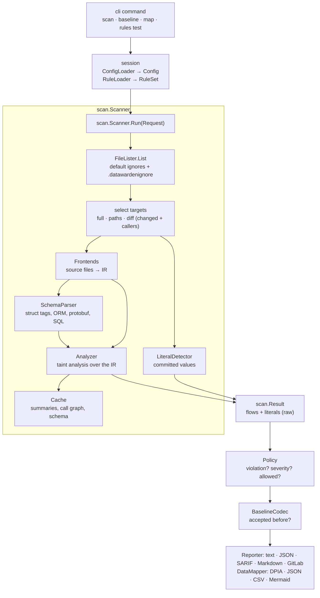
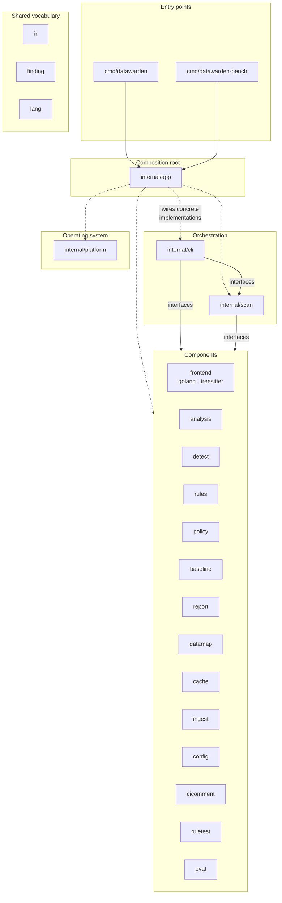
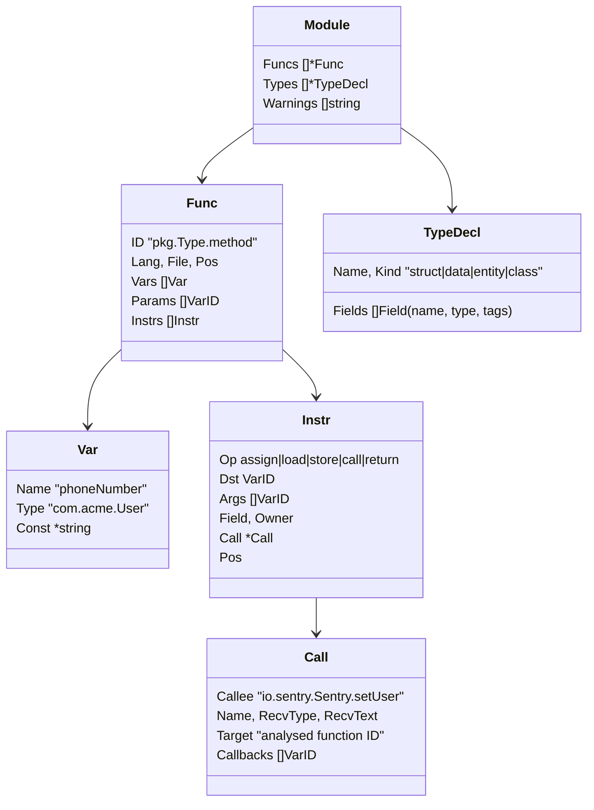
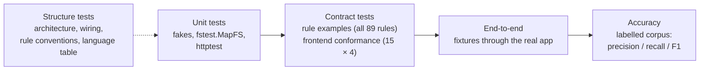

# datawarden architecture

This document explains how datawarden is put together: the pipeline a scan goes through, the packages and the rules that keep them independent, the data model they share, and where to extend it. The [README](../README.md) covers usage; [CONTRIBUTING](../CONTRIBUTING.md) has the step-by-step checklists for adding a rule or a language.

## Contents

- [What datawarden does](#what-datawarden-does)
- [The scan pipeline](#the-scan-pipeline)
- [Packages and layers](#packages-and-layers)
- [Design rules](#design-rules)
- [Interfaces and who implements them](#interfaces-and-who-implements-them)
- [Data model](#data-model)
- [The taint analysis](#the-taint-analysis)
- [Scan modes and the cache](#scan-modes-and-the-cache)
- [Extension points](#extension-points)
- [How it is tested](#how-it-is-tested)

## What datawarden does

datawarden is a static analyzer. It reads a repository without running it and reports two kinds of findings:

- **Flows:** personal data (a *source*: a variable named `email`, a field tagged `pii:"phone"`, the result of `telephony.getLine1Number()`) reaching a place it should not go (a *sink*: a logger, a crash reporter, an analytics SDK, a third-party HTTP API, device storage).
- **Literals:** real-looking personal data committed to the repository (a valid phone number, card number or citizen ID in a fixture or seed file).

Four languages are analysed (Go, Kotlin, Java, TypeScript/JavaScript). Each is converted into one shared intermediate representation (IR), so the analysis, the rules and the reports are written once.

## The scan pipeline

1. **Session.** The command finds the repository root, loads `.datawarden.yaml` and the rules (built-in plus the repository's `.datawarden/rules/`).
2. **File selection.** The scanner lists files (skipping build output, dependencies and `.datawardenignore` patterns) and decides what to analyse: everything, the paths given, or in PR mode the changed files plus their callers from the cached call graph.
3. **Literal scan.** Text files are checked for committed personal data by validating detectors (Luhn, IBAN checksum, CCCD structure, phone prefixes) and nearby labels.
4. **Lowering.** Each language's frontend converts its files into IR functions and type declarations.
5. **Schema.** Declared types, protobuf messages and SQL tables become schema hints: "field `Customer.Contact` holds a phone number".
6. **Analysis.** The taint engine follows personal data through the IR to sinks and produces flows. Summaries and the call graph go into the cache.
7. **Policy, baseline, output.** The policy marks violations; the baseline marks the ones already accepted; the reporter renders the result. The exit code is 1 when there is a new violation.

## Packages and layers

| Layer | Packages | Role |
|---|---|---|
| Entry points | `cmd/datawarden`, `cmd/datawarden-bench` | `main`: build the app with `app.New` and run it. |
| Composition root | `internal/app` | The only place that chooses concrete implementations and connects them. |
| Orchestration | `internal/cli`, `internal/scan` | Commands, flags and exit codes; the scan pipeline. They know *what* happens, not *how*. |
| Components | `frontend/*`, `analysis`, `detect`, `rules`, `policy`, `baseline`, `report`, `datamap`, `cache`, `ingest`, `config`, `cicomment`, `ruletest`, `eval` | One job each, behind interfaces their consumers declare. |
| Operating system | `internal/platform` | The only package that touches disk, processes (`git`) and the cache file. |
| Vocabulary | `internal/ir`, `internal/finding`, `internal/lang` | Types every component exchanges: the IR, findings, the language table. |

What each component does:

| Package | Responsibility |
|---|---|
| `frontend` | The `Frontend` interface, the `Registry` of frontends per language, the `Registrar` plugin contract. |
| `frontend/golang` | Go via `go/packages` and SSA: full type information. |
| `frontend/treesitter` | Kotlin, Java, TypeScript via tree-sitter (cgo): syntax plus import and declaration resolution. |
| `analysis` | The taint engine: sources, propagation, function summaries, flows. |
| `detect` | Identifier classifier and taxonomy, schema index, literal validators. |
| `rules` | Loading, validating and matching YAML sink, source and transform rules. |
| `policy` | Which flows are violations, their severity, allowed transforms and allow-list entries. |
| `baseline` | Line-independent fingerprints and the baseline document. |
| `report` | Text, JSON, SARIF, Markdown and GitLab output. |
| `datamap` | The personal-data inventory (DPIA, JSON, CSV, Mermaid). |
| `cache` | Function summaries, call graph and schema between runs, keyed by file content. |
| `ingest` | File walking, ignore patterns, file selection, git queries. |
| `config` | `.datawarden.yaml`: parsing, defaults, validation. |
| `cicomment` | Creating or updating the PR/MR comment on GitHub or GitLab. |
| `ruletest` | `ruleid:`/`ok:` annotations in example code, checked against findings. |
| `eval` | Precision, recall and F1 of a labelled corpus; used by `datawarden-bench`. |

## Design rules

These rules keep the components replaceable and testable. Each one is checked by a test, so a change that breaks one fails CI.

| Rule | Why | Enforced by |
|---|---|---|
| **Components talk only through interfaces.** A package declares the small interface it needs, next to the code that uses it; another package implements it. | A component can be replaced, faked in tests, or reimplemented without touching its users. | `TestComponentsTalkThroughInterfaces` (`internal/app`): type-checks the module and fails on any call into another component's concrete functions or methods. Calls into `ir`, `finding` and `lang` are allowed. |
| **Only `internal/app` chooses implementations.** | Wiring lives in one place; tests wire fakes the same way. | The same test (it skips `internal/app` and `cmd/`). |
| **Only `internal/platform` touches the OS.** Everything else reads through `fs.FS` and receives its clock, environment and HTTP client. | Tests run on in-memory file systems and fixed clocks. | Code review. Apart from `platform`, only the wiring code (`internal/app`, `cmd/`) imports `os`, to hand stdout, the environment and `os.ReadFile` to the components. |
| **No package-level mutable state and no `init()` registration.** Frontends are registered explicitly; the classifier is built from a taxonomy value. | Two scans in one process cannot interfere; tests can build any configuration. | Code review. |
| **Missing dependencies are errors.** `cli.App` and `scan.Scanner` list what was not wired instead of falling back to a default. | Wiring mistakes show up at start-up, not as silently wrong results. | `App.check`, `Scanner.validate`. |
| **Languages are described once** (`internal/lang`). | Adding a language does not mean editing six switch statements. | `TestTableIsConsistent`, `TestEveryLanguageIsWired`. |

## Interfaces and who implements them

Interfaces are declared by the consumer. The table shows where each one lives and what `internal/app` plugs in.

| Consumer | Interface | Production implementation | Typical test double |
|---|---|---|---|
| `cli.App` | `Workspace` | `platform.OS` | in-memory workspace |
| | `Scanner` | `scan.Scanner` | fake returning fixed flows |
| | `CacheOpener` | `cache.Open` + `platform.FileBlob` | `cache.Memory` |
| | `Commenter` | `cicomment.Client` | recording fake |
| | `Catalog` | `detect.Classifier` | real classifier |
| | `ConfigLoader` | `config.Loader` | real loader |
| | `RuleLoader` → `RuleSet` | `rules.Load` (adapter in `app`) | real rules |
| | `Policy` | `policy.Policies` | real or fixed policy |
| | `BaselineCodec` | `baseline.Codec` | real codec |
| | `Reporter` | `report.Writer` | real writer |
| | `DataMapper` | `datamap.Mapper` | real mapper |
| | `RuleTester` | `ruletest.Tester` | real tester |
| `scan.Scanner` | `FileLister` | `ingest.Lister` | `ingest.Lister` on `fstest.MapFS` |
| | `Frontends` | `frontend.Registry` | fake frontends |
| | `Analyzer` | `analysis.Engine` | fake analyzer |
| | `LiteralDetector` | `detect.LiteralScanner` | fake detector |
| | `SchemaParser` | `detect.Schemas` | fake parser |
| | `Cache` | `cache.Store` | `cache.Memory` |
| | `VCS` | `ingest.Git` + `platform.ExecGit` | `ingest.NoVCS`, scripted git |
| `analysis.Engine` | `RuleMatcher` | `rules.Set` | fake rule matcher |
| | `SchemaIndex` | `detect.Schema` | built from test types |
| | `NameClassifier` | `detect.Classifier` | real classifier |
| `golang.Frontend` | `PackageLoader` | `packages.Load` | fake loader |
| `golang`, `treesitter` | `frontend.Registrar` | `frontend.Registry` | any registrar |
| `cache.Store` | `Persister`, `Hasher` | `platform.FileBlob`, `ingest.Hasher` | in-memory persister, map hasher |
| `ingest.Git` | `Runner` | `platform.ExecGit` | scripted runner |
| `cicomment.Client` | `Doer`, `Getenv`, `ReadFile` | `http.Client`, `os.Getenv`, `os.ReadFile` | `httptest` server |
| `report`, `policy`, `datamap` | `Catalog`, `RuleLookup` | `detect.Classifier`, `rules.Set` | fixed catalog |

`app.NewWith(stdout, stderr, app.Deps{...})` builds the production wiring with a different workspace, clock, environment or HTTP client; the end-to-end tests in `internal/app` use it.

## Data model

### The IR (`internal/ir`)

Every frontend produces the same small language. It is deliberately simple: enough to follow values, not enough to run code.

- **Five operations.** `assign` (copies, concatenation, conversions, container construction), `load` and `store` (fields and constant map keys), `call`, `return`. Anything else a language has lowers to these.
- **Callee names are qualified** the way rules are written: `importpath.Type.Method` for Go, `package.Class.method` for Kotlin/Java, `<module>.<export>` for TypeScript. `Target` is set when the callee is code datawarden analyses, so its summary can be applied.
- **Positions are slash-separated and root-relative** on every platform.

### Findings (`internal/finding`)

- `Flow`: data type, source and sink positions, the path between them, sink rule, destination (kind, host, vendor), transforms applied (masked, hashed, ...), confidence, enclosing function; after policy and baseline, `Violation`, `Severity`, `Allowed`, `Baselined` and a line-independent `Fingerprint`.
- `Literal`: data type, position, masked value, value hash, detector, confidence; the same policy and baseline fields.

### Rules (`internal/rules`)

YAML rules of three kinds, each matched against IR calls:

- **sink**: data in the selected arguments leaves to a destination (`dest.kind`: `log`, `third_party`, `network`, `storage`, `ipc`, `first_party`).
- **source**: the call returns personal data of a given type.
- **transform**: the call masks, hashes or encrypts its input; the policy decides which transforms make a flow acceptable.

Built-in rules are embedded in the binary; a repository adds, replaces or disables them by id.

## The taint analysis

`analysis.Engine` works per function and composes results through summaries.

1. **Seeding.** A variable becomes a source when its name classifies as personal data (`phoneNumber`, not `phoneFormatter`), when its type has personal-data fields (a `User` value), when it is loaded from a field the schema marks, when it is stored under a key that names it (`{"email": v}`), when it comes from a getter (`getEmail()`), or when a source rule matches the call that produced it.
2. **Propagation.** Facts flow through assignments, field stores and loads, calls and returns. Unknown library calls pass their arguments' facts to the result, with a small confidence decay; transform rules and names like `maskEmail` record a transform instead.
3. **Summaries.** Each function gets a summary: which parameter reaches which sink, the return value, or another parameter. Callers apply the summaries of their callees; strongly connected components (recursion) iterate to a fixed point. This is how a value is followed through helpers several calls deep.
4. **Flows.** When a fact reaches a sink argument, a flow is emitted with confidence = source × propagation × rule match.

Everything downstream is policy, not analysis: `policy` turns flows into violations (destination kinds that fail the build, minimum confidence, safe transforms, allow-list entries).

## Scan modes and the cache

| Mode | What is analysed | Used for |
|---|---|---|
| full | every source file | CI on the default branch, `baseline`, `map` |
| paths | the files or directories given | local checks |
| diff (`--diff <ref>`) | files changed since the merge base, plus their callers from the cached call graph (`--caller-depth`) | pull requests |
| literals only | committed values in the listed or staged files | pre-commit hooks |

The cache stores function summaries, the call graph and schema declarations keyed by file content hash and by the rule-set hash. A PR scan lowers only the changed files and reuses the summaries of everything else, so it stays fast on large repositories.

## Extension points

| To add | Do this | Guarded by |
|---|---|---|
| **A rule** for an SDK | YAML entry in `internal/rules/builtin/` (or `.datawarden/rules/` in your repository), plus an annotated example | `TestBuiltinRuleConventions`, `TestRuleExamples`, `datawarden rules test` |
| **A language** | entry in `internal/lang`, a frontend, registration in `app.NewComponents`, the 15 conformance programs, rules with examples | `TestEveryLanguageIsWired`, `TestFrontendConformance`, `TestRuleExamples` |
| **A data type or identifier word** | `internal/detect/taxonomy.go`, table-driven cases in `detect_test.go` | `TestBuiltinRuleConventions` (source rules must use known types) |
| **An output format** | a case in `report.Write` (or a new `Reporter` implementation wired in `app`) | report tests |
| **A service or replacement component** | an interface where it is used, a field to inject it, the wiring in `internal/app` | `TestComponentsTalkThroughInterfaces` |
| **A labelled benchmark case** | a directory under `testdata/` and its labels in `testdata/eval.yaml` | `datawarden-bench -check` in CI |

The full checklists for rules and languages are in [CONTRIBUTING](../CONTRIBUTING.md#add-or-fix-a-rule).

## How it is tested

- **Unit tests** exercise each component with fakes of its interfaces: the CLI with an in-memory workspace and a fake scanner, the scanner with fake frontends and analyzer, the engine with a fake rule matcher.
- **Contract tests** run real code through the full scan. Every built-in rule has an annotated example (`internal/rules/testdata/examples/`). Every frontend implements the same 15 conformance scenarios (`internal/frontend/testdata/conformance/`). Known gaps are marked `todoruleid:`, and the test fails once one is fixed, so the list stays accurate.
- **End-to-end tests** scan the fixtures in `testdata/` with the production wiring.
- **Accuracy** is measured on the labelled corpus (`testdata/eval.yaml`, including the vulnerable-by-design `testdata/vulnshop`). CI fails when a case drops below its minimum precision or recall.
- **Structure tests** keep the architecture from eroding: interface-only communication, every language wired, rule conventions, a consistent language table.
- **Coverage** is measured across packages (`go test -coverpkg=./internal/... ./...`, about 87%); CI fails below 85%.
- **Benchmarks** (`make bench`) cover the engine's scaling, the detectors and end-to-end scans; `--cpuprofile`/`--memprofile` profile real runs.
