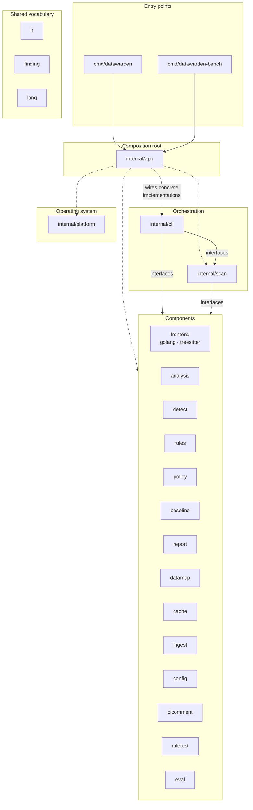
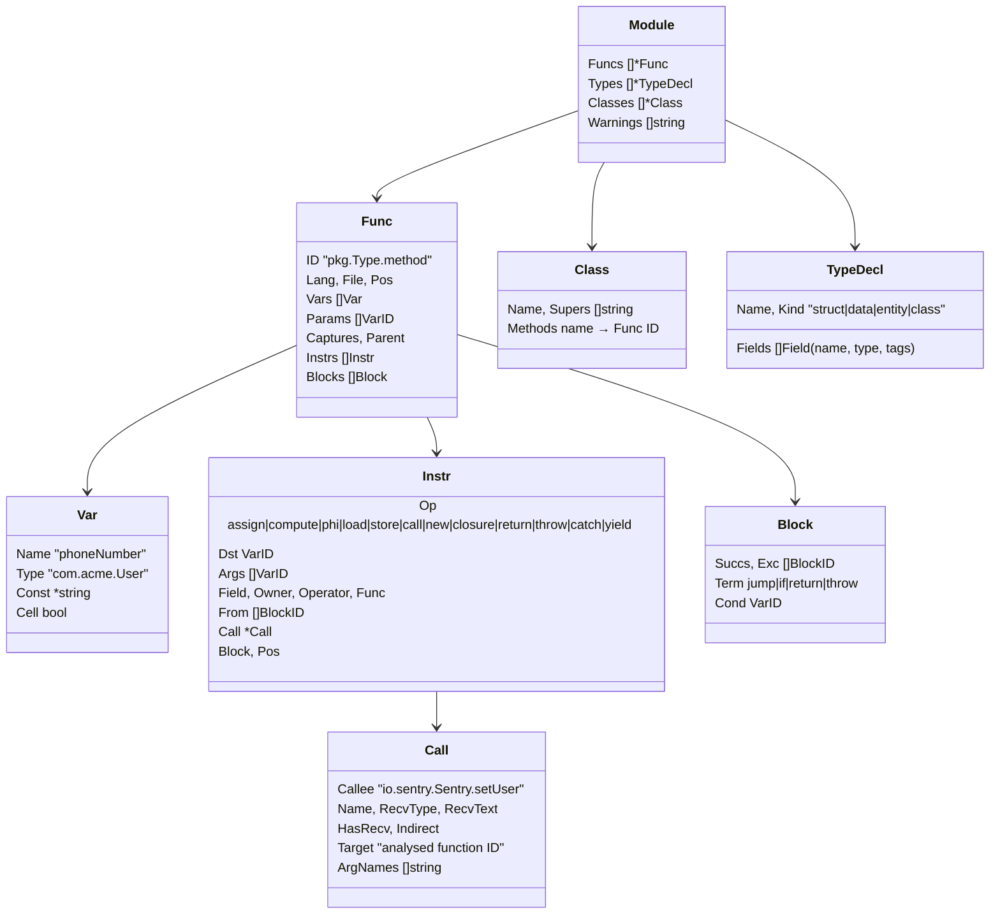
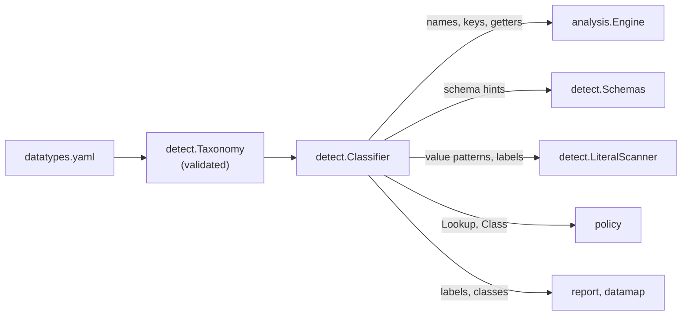
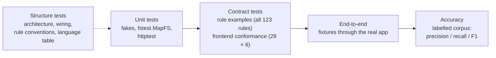

# datawarden architecture

This document explains how datawarden is put together: the pipeline a scan goes through, the packages and the rules that keep them independent, the data model they share, and where to extend it. The [README](../README.md) covers usage; [CONTRIBUTING](../CONTRIBUTING.md) has the step-by-step checklists for adding a rule or a language.

## Contents

- [What datawarden does](#what-datawarden-does)
- [The scan pipeline](#the-scan-pipeline)
- [Packages and layers](#packages-and-layers)
- [Design rules](#design-rules)
- [Interfaces and who implements them](#interfaces-and-who-implements-them)
- [Data model](#data-model)
- [The taxonomy: data types and classes](#the-taxonomy-data-types-and-classes)
- [The taint analysis](#the-taint-analysis)
- [Scan modes and the cache](#scan-modes-and-the-cache)
- [Extension points](#extension-points)
- [How it is tested](#how-it-is-tested)

## What datawarden does

datawarden is a static analyzer. It reads a repository without running it and reports two kinds of findings:

- **Flows:** sensitive data (a *source*: a variable named `email` or `accessToken`, a field tagged `pii:"phone"`, the result of `telephony.getLine1Number()`) reaching a place it should not go (a *sink*: a logger, a crash reporter, an analytics SDK, a third-party HTTP API, device storage).
- **Literals:** real-looking sensitive values committed to the repository (a valid card number, IBAN or US Social Security number in a fixture or seed file; a cloud access key or a token in a config file).

What counts as sensitive is data, not code: the [taxonomy](#the-taxonomy-data-types-and-classes) groups data types into classes (personal data, health information, cardholder data, credentials), and the analysis, the policy and the reports treat a new type or class like the built-in ones.

Six languages are analysed (Go, Python, Java, Kotlin, Swift, TypeScript/JavaScript). Each is converted into one shared intermediate representation (IR), so the analysis, the rules and the reports are written once.

## The scan pipeline

1. **Session.** The command finds the repository root, loads `.datawarden.yaml` and the rules (built-in plus the repository's `.datawarden/rules/`).
2. **File selection.** The scanner lists files (skipping build output, dependencies and `.datawardenignore` patterns) and decides what to analyse: everything, the paths given, or in PR mode the changed files plus their callers from the cached call graph.
3. **Literal scan.** Text files are checked for committed personal data by validating detectors (Luhn, IBAN checksum, SSN structure, email filters, secret value patterns) and nearby labels.
4. **Lowering.** Each language's frontend converts its files into IR functions and type declarations.
5. **Schema.** Declared types, protobuf messages and SQL tables become schema hints: "field `Customer.Contact` holds a phone number".
6. **Analysis.** The taint engine follows personal data through the IR to sinks and produces flows. Summaries and the call graph go into the cache.
7. **Policy, baseline, output.** The policy marks violations; the baseline marks the ones already accepted; the reporter renders the result. The exit code is 1 when there is a new violation.

## Packages and layers

| Layer | Packages | Role |
|---|---|---|
| Entry points | `cmd/datawarden`, `cmd/datawarden-bench` | `main`: build the app with `app.New` and run it. |
| Composition root | `internal/app` | The only place that chooses concrete implementations and connects them. |
| Orchestration | `internal/cli`, `internal/scan` | Commands, flags and exit codes; the scan pipeline. They know *what* happens, not *how*. |
| Components | `frontend/*`, `analysis`, `detect`, `rules`, `policy`, `baseline`, `report`, `datamap`, `cache`, `ingest`, `config`, `cicomment`, `ruletest`, `eval` | One job each, behind interfaces their consumers declare. |
| Operating system | `internal/platform` | The only package that touches disk, processes (`git`) and the cache file. |
| Vocabulary | `internal/ir`, `internal/finding`, `internal/lang` | Types every component exchanges: the IR, findings, the language table. |

What each component does:

| Package | Responsibility |
|---|---|
| `frontend` | The `Frontend` interface, the `Registry` of frontends per language, the `Registrar` plugin contract. |
| `frontend/golang` | Go via `go/packages` and SSA: full type information. |
| `frontend/treesitter` | Python, Java, Kotlin, Swift, TypeScript via tree-sitter (cgo): syntax plus import and declaration resolution. |
| `analysis` | The taint engine: sources, propagation, function summaries, flows. |
| `detect` | Identifier classifier and taxonomy, schema index, literal validators. |
| `rules` | Loading, validating and matching YAML sink, source and transform rules. |
| `policy` | Which flows are violations, their severity, allowed transforms and allow-list entries. |
| `baseline` | Line-independent fingerprints and the baseline document. |
| `report` | Text, JSON, SARIF, Markdown and GitLab output. |
| `datamap` | The personal-data inventory (DPIA, JSON, CSV, Mermaid). |
| `cache` | Function summaries, call graph and schema between runs, keyed by file content. |
| `ingest` | File walking, ignore patterns, file selection, git queries. |
| `config` | `.datawarden.yaml`: parsing, defaults, validation. |
| `cicomment` | Creating or updating the PR/MR comment on GitHub or GitLab. |
| `ruletest` | `ruleid:`/`ok:` annotations in example code, checked against findings. |
| `eval` | Precision, recall and F1 of a labelled corpus; used by `datawarden-bench`. |

## Design rules

These rules keep the components replaceable and testable. Each one is checked by a test, so a change that breaks one fails CI.

| Rule | Why | Enforced by |
|---|---|---|
| **Components talk only through interfaces.** A package declares the small interface it needs, next to the code that uses it; another package implements it. | A component can be replaced, faked in tests, or reimplemented without touching its users. | `TestComponentsTalkThroughInterfaces` (`internal/app`): type-checks the module and fails on any call into another component's concrete functions or methods. Calls into `ir`, `finding` and `lang` are allowed. |
| **Only `internal/app` chooses implementations.** | Wiring lives in one place; tests wire fakes the same way. | The same test (it skips `internal/app` and `cmd/`). |
| **Only `internal/platform` touches the OS.** Everything else reads through `fs.FS` and receives its clock, environment and HTTP client. | Tests run on in-memory file systems and fixed clocks. | Code review. Apart from `platform`, only the wiring code (`internal/app`, `cmd/`) imports `os`, to hand stdout, the environment and `os.ReadFile` to the components. |
| **No package-level mutable state and no `init()` registration.** Frontends are registered explicitly; the classifier is built from a taxonomy value. | Two scans in one process cannot interfere; tests can build any configuration. | Code review. |
| **Missing dependencies are errors.** `cli.App` and `scan.Scanner` list what was not wired instead of falling back to a default. | Wiring mistakes show up at start-up, not as silently wrong results. | `App.check`, `Scanner.validate`. |
| **Languages are described once** (`internal/lang`). | Adding a language does not mean editing six switch statements. | `TestTableIsConsistent`, `TestEveryLanguageIsWired`. |

## Interfaces and who implements them

Interfaces are declared by the consumer. The table shows where each one lives and what `internal/app` plugs in.

| Consumer | Interface | Production implementation | Typical test double |
|---|---|---|---|
| `cli.App` | `Workspace` | `platform.OS` | in-memory workspace |
| | `Scanner` | `scan.Scanner` | fake returning fixed flows |
| | `CacheOpener` | `cache.Open` + `platform.FileBlob` | `cache.Memory` |
| | `Commenter` | `cicomment.Client` | recording fake |
| | `Catalog` | `detect.Classifier` | real classifier |
| | `ConfigLoader` | `config.Loader` | real loader |
| | `RuleLoader` → `RuleSet` | `rules.Load` (adapter in `app`) | real rules |
| | `Policy` | `policy.Policies` | real or fixed policy |
| | `BaselineCodec` | `baseline.Codec` | real codec |
| | `Reporter` | `report.Writer` | real writer |
| | `DataMapper` | `datamap.Mapper` | real mapper |
| | `RuleTester` | `ruletest.Tester` | real tester |
| `scan.Scanner` | `FileLister` | `ingest.Lister` | `ingest.Lister` on `fstest.MapFS` |
| | `Frontends` | `frontend.Registry` | fake frontends |
| | `Analyzer` | `analysis.Engine` | fake analyzer |
| | `LiteralDetector` | `detect.LiteralScanner` | fake detector |
| | `SchemaParser` | `detect.Schemas` | fake parser |
| | `Cache` | `cache.Store` | `cache.Memory` |
| | `VCS` | `ingest.Git` + `platform.ExecGit` | `ingest.NoVCS`, scripted git |
| `analysis.Engine` | `RuleMatcher` | `rules.Set` | fake rule matcher |
| | `SchemaIndex` | `detect.Schema` | built from test types |
| | `NameClassifier` | `detect.Classifier` | real classifier |
| `golang.Frontend` | `PackageLoader` | `packages.Load` | fake loader |
| `golang`, `treesitter` | `frontend.Registrar` | `frontend.Registry` | any registrar |
| `cache.Store` | `Persister`, `Hasher` | `platform.FileBlob`, `ingest.Hasher` | in-memory persister, map hasher |
| `ingest.Git` | `Runner` | `platform.ExecGit` | scripted runner |
| `cicomment.Client` | `Doer`, `Getenv`, `ReadFile` | `http.Client`, `os.Getenv`, `os.ReadFile` | `httptest` server |
| `report`, `policy`, `datamap` | `Catalog`, `RuleLookup` | `detect.Classifier`, `rules.Set` | fixed catalog |

`app.NewWith(stdout, stderr, app.Deps{...})` builds the production wiring with a different workspace, clock, environment or HTTP client; the end-to-end tests in `internal/app` use it.

## Data model

### The IR (`internal/ir`)

Every frontend produces the same small language. It is deliberately simple: enough to follow values, not enough to run code. [IR.md](IR.md) is its specification, and `ir.Verify` checks every frontend's output against it in the tests.

- **Three-address instructions over SSA variables.** Each instruction reads variables and defines at most one. `assign` copies or merges references (the result aliases its arguments and sees their later mutations); `compute` builds a new value from the arguments' current state (concatenation, interpolation, arithmetic, conversions), and a logical `compute` (`!`, `&&`, a comparison) yields a boolean that carries no data. `phi` merges the versions arriving from each predecessor block. `load` and `store` read and write fields and constant map keys; `call`, `new` (the constructor is its `Target`), `closure`, `return`, `throw`, `catch` and `yield` do what their names say. Anything else a language has lowers to these.
- **One variable per assignment (SSA form).** Assigning to a local creates a new variable with the same name; later reads use it, earlier reads keep the old one. Where paths join (after `if`/`else`, `switch`, `when`, `match`, `try`/`catch`, a loop header) a name bound to different versions gets a phi. A definition dominates its uses. The only exception is a *cell*, a location written by weak updates: an array written by index, a Go variable written through a pointer, a captured variable a closure assigns. Go gets SSA form from `x/tools/go/ssa`; the tree-sitter frontends use the shared helpers in `internal/frontend/treesitter/common.go` (`redefine`, `join`, `branches`, `loopWith`, `switchCases`, `tryCatch`, `valued`).
- **A control-flow graph of basic blocks.** Every instruction names its block; the instructions of a block are contiguous and run in order. A block ends with a terminator: a jump, a two-way branch on a condition variable, a return or a throw. Go gets its blocks from `x/tools/go/ssa`; the tree-sitter builder starts a block for every arm of a branch, loop header, body and exit, handler and join, a `return` ends its path, `break` and `continue` jump to their loop or switch (labels included; C-style `switch` cases fall through), and an `if` ends with a branch on its condition (a negation swaps the successors' meaning through its `!` operator). Inside a `try`, every call and `throw` ends its block with an *exceptional edge* to the handlers, which start with a `catch` and a phi of the state at each of those points. Conditions that are constant in the source (literals, negations, locals and declared constants such as `static final boolean DEBUG = false`) are folded, so the arm that cannot run is not lowered; Go does the same for SSA branches on constants.
- **Closures are functions.** A lambda, closure, local function or method of an anonymous class is lowered as its own function (`parent$1`) whose last `Captures` parameters are the enclosing variables it uses; `closure` creates it and binds them. Calling a closure held in a variable is an `Indirect` call. A Go function used as a value is a closure without captures.
- **A class table.** `Module.Classes` lists classes, interfaces, protocols and Go named types with their supertypes and methods. The engine resolves dynamically dispatched calls with it (class hierarchy analysis); for Go, the supertypes are the interfaces a type implements.
- **Callee names are qualified** the way rules are written: `importpath.Type.Method` for Go, `package.Class.method` for Kotlin/Java, `<module>.<export>` for TypeScript, `<module>.<name>` for Python, the type as written for Swift. `Target` is set when the callee is code datawarden analyses, so its summary can be applied.
- **Positions are slash-separated and root-relative** on every platform.

### Findings (`internal/finding`)

- `Flow`: data type and its class, source and sink positions, the path between them, sink rule, destination (kind, host, vendor), transforms applied (masked, hashed, ...), confidence, enclosing function; after policy and baseline, `Violation`, `Severity`, `Allowed`, `Baselined` and a line-independent `Fingerprint`.
- `Literal`: data type and class, position, masked value, value hash, detector, confidence; the same policy and baseline fields.

### Rules (`internal/rules`)

YAML rules of three kinds, each matched against IR calls:

- **sink**: data in the selected arguments leaves to a destination (`dest.kind`: `log`, `third_party`, `network`, `storage`, `ipc`, `first_party`).
- **source**: the call returns personal data of a given type.
- **transform**: the call masks, hashes or encrypts its input; the policy decides which transforms make a flow acceptable.

Built-in rules are embedded in the binary; a repository adds, replaces or disables them by id.

## The taxonomy: data types and classes

`internal/detect/builtin/datatypes.yaml` is embedded in the binary and parsed strictly by `detect.ParseTaxonomy`. It declares:

- **Classes**: `pii`, `phi`, `pci`, `credential`. A class has a label, a description and optionally `severity: high`.
- **Data types**: each has a class, a category for the data map, identifier `patterns` and `weak` patterns, `exclude` words, flags that raise severity (`sensitive`, `severity: high`) and `values`, regular expressions for committed values (with `keywords` that must appear on the line before the regex runs, a confidence and a minimum entropy).

The classifier is the only component that reads the taxonomy; everything else asks it through small interfaces (`policy.Catalog` has `Lookup(id)` and `Class(id)`). The policy uses the class to set a finding's `Class`, to raise severity for high-severity classes, to drop `ignore_classes`, and to apply per-class `fail_on` and `safe_transforms` overrides: by default credentials may go over the network and may be hashed, personal data may not. Reports tag SARIF rules with the class and the data map has a class column. Adding a class therefore touches only the YAML.

A data type that is not in the taxonomy (a custom type named by a repository's source rule or a `pii:"loyalty_card"` tag) is still reported, as class `pii` and category `custom`.

## The taint analysis

`analysis.Engine` works per function and composes results through summaries.

1. **Seeding.** A variable becomes a source when its name classifies as personal data (`phoneNumber`, not `phoneFormatter`) and it is not a new version of a same-named value (`email = sha256(email)` carries whatever its definition carries, the hash included), when its type has personal-data fields (a `User` value), when it is loaded from a field the schema marks, when it is stored under a key that names it (`{"email": v}`), when it comes from a getter (`getEmail()`), or when a source rule matches the call that produced it.
2. **Propagation.** Facts flow through assignments, field stores and loads, calls and returns. Values are ordered by their SSA variables; mutations of objects by the control-flow graph: a fact put on an object by a field store, a mutating call (`add`, `append`, `put`, ...) or a callee that writes into an argument records the instruction, and only instructions that instruction can run before see it (`analysis/order.go`). Copies keep the mark, so `view = items; items.add(email); log(view)` is still reported. Unknown library calls pass their arguments' facts to the result, with a small confidence decay; transform rules and names like `maskEmail` record a transform instead. Network sinks are the exception: their result is the remote's response, not the request, so a login call's reply does not carry the password.
3. **Summaries.** Each function gets a summary: which parameter reaches which sink, the return value, an exception it throws, or another parameter. Entries can name a field (`Field`: `this.addr` reaches the log; `DstField`: a constructor stores the value in `this.addr`, a factory returns it in `result.addr`), so objects keep their structure across calls. Field entries are access paths up to three fields deep (`profile.note`): a store into an object read from another one's field (`t = user.profile; t.note = email`) is also a store into the longer path of the outer object. Callers apply the summaries of their callees, arranging keyword arguments by name (`Call.ArgNames`), running constructors on the new object (`new`), every override or implementation of a dynamically dispatched call (`analysis/hierarchy.go`, over the class table), and sending what a callee throws to the handler its block's exceptional edge leads to, or out of the caller. A closure's summary is applied where it runs: at an indirect call with the call's arguments, or, for a closure passed as an argument, at that call with the call's other arguments. Its captures are read as they are at the call when the callee is known to run it before returning (`analysis/callbacks.go`: `forEach`, `map`, `apply`, `sort.Slice`, …), and as they are at any time otherwise, since the callee may keep it and run it later. Where closures go is a whole-program, flow-insensitive analysis (`analysis/closures.go`): through variables, fields (by owner type and name) and collections, into the parameters of the functions they are passed to and out of the ones that return them. So a handler passed to a constructor runs where another method calls the field (`this.onSend(v)`), listeners added to a list run in the loop that calls them, and a closure a factory returns runs where the caller calls it; a method call on a receiver holding closures runs them unless it is a collection operation (`add`, `get(i)`, `iterator`, …). A closure a function received as a parameter is not run there, since its caller already runs it with the call's arguments and the callee would mix up what different callers pass. Captures are bound in the function that created the closure; one that leaves it (stored, returned) is run at that point with its captures as they are at any time. A flow inside a closure is reported in the named function that contains it. Strongly connected components (recursion) iterate to a fixed point. This is how a value is followed through helpers several calls deep.
4. **Flows.** When a fact reaches a sink argument, a flow is emitted with confidence = source × propagation × rule match. If the sink runs only after a consent check passed (its block, or the call leading to it, is dominated by the "consent given" successor of a branch on `hasConsent()`, `user.optedIn`, `analyticsEnabled` and the like), the flow lists that check in `Guards`; reports show it, and an unguarded path to the same sink wins over a guarded one. A call of a helper whose every return is a consent check counts as the check, and a function inherits the checks that guard every call of it (the intersection over its call sites, iterated through callers; in PR mode not when the cache knows a caller outside the run). The policy accepts guarded flows to the destination kinds in `policy.consent_guarded`.

Everything downstream is policy, not analysis: `policy` turns flows into violations (destination kinds that fail the build, minimum confidence, safe transforms, allow-list entries, each overridable per class).

## Scan modes and the cache

| Mode | What is analysed | Used for |
|---|---|---|
| full | every source file | CI on the default branch, `baseline`, `map` |
| paths | the files or directories given | local checks |
| diff (`--diff <ref>`) | files changed since the merge base, plus their callers from the cached call graph (`--caller-depth`) | pull requests |
| literals only | committed values in the listed or staged files | pre-commit hooks |

The cache stores function summaries, the call graph, schema declarations and the class table keyed by file content hash and by the rule-set hash. A PR scan lowers only the changed files and reuses the summaries of everything else, so it stays fast on large repositories; the cached class table lets a changed call through an interface still reach implementations in unchanged files.

## Extension points

| To add | Do this | Guarded by |
|---|---|---|
| **A rule** for an SDK | YAML entry in `internal/rules/builtin/` (or `.datawarden/rules/` in your repository), plus an annotated example | `TestBuiltinRuleConventions`, `TestRuleExamples`, `datawarden rules test` |
| **A language** | entry in `internal/lang`, a frontend, registration in `app.NewComponents`, the 29 conformance programs, rules with examples | `TestEveryLanguageIsWired`, `TestFrontendConformance`, `TestRuleExamples` |
| **A data type, a class or a secret pattern** | an entry in `internal/detect/builtin/datatypes.yaml`, cases in `detect_test.go` or `secrets_test.go`, a labelled leak in a fixture | `TestBuiltinTaxonomy`, `TestTaxonomyValidation`, `TestBuiltinRuleConventions` (source rules must use known types), `datawarden-bench -check` |
| **A negative-context or transform word** | `internal/detect/names.go` | `detect_test.go` |
| **An output format** | a case in `report.Write` (or a new `Reporter` implementation wired in `app`) | report tests |
| **A service or replacement component** | an interface where it is used, a field to inject it, the wiring in `internal/app` | `TestComponentsTalkThroughInterfaces` |
| **A labelled benchmark case** | a directory under `testdata/` and its labels in `testdata/eval.yaml` | `datawarden-bench -check` in CI |

The full checklists for rules and languages are in [CONTRIBUTING](../CONTRIBUTING.md#add-or-fix-a-rule).

## How it is tested

- **Unit tests** exercise each component with fakes of its interfaces: the CLI with an in-memory workspace and a fake scanner, the scanner with fake frontends and analyzer, the engine with a fake rule matcher.
- **Contract tests** run real code through the full scan. Every built-in rule has an annotated example (`internal/rules/testdata/examples/`). Every frontend implements the same 32 conformance scenarios (`internal/frontend/testdata/conformance/`), and the IR it produces for them, the rule examples and the test repositories passes `ir.Verify` (`TestLoweredIRVerifies`). Known gaps are marked `todoruleid:`, and the test fails once one is fixed, so the list stays accurate.
- **End-to-end tests** scan the fixtures in `testdata/` with the production wiring.
- **Accuracy** is measured on the labelled corpus (`testdata/eval.yaml`, including the vulnerable-by-design `testdata/vulnshop`). CI fails when a case drops below its minimum precision or recall.
- **Structure tests** keep the architecture from eroding: interface-only communication, every language wired, rule conventions, a consistent language table.
- **Coverage** is measured across packages (`go test -coverpkg=./internal/... ./...`, about 87%); CI fails below 85%.
- **Benchmarks** (`make bench`) cover the engine's scaling, the detectors and end-to-end scans; `--cpuprofile`/`--memprofile` profile real runs.
